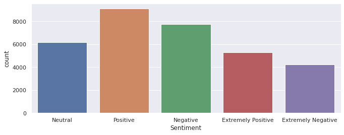
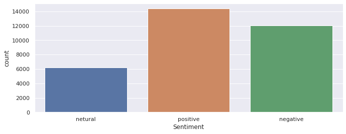
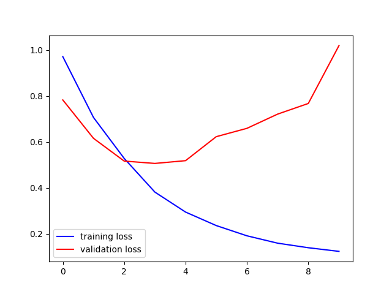
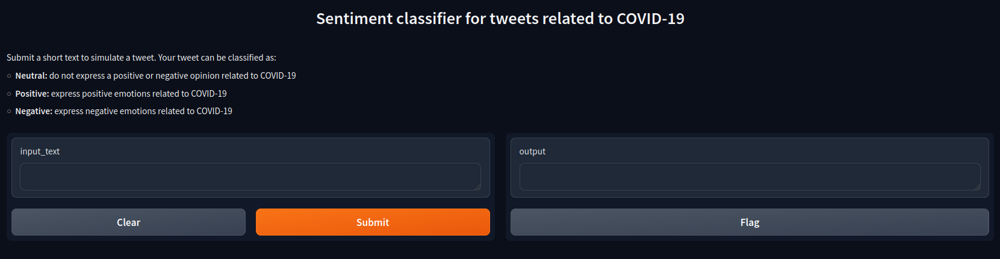
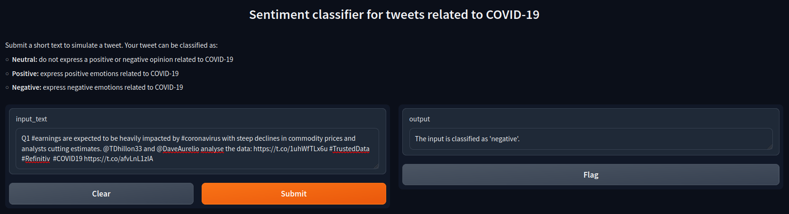

# 🤖 Projeto Final
Projeto Final da disciplina Projeto de Sistemas Baseados em Aprendizado de Máquina da UFRN, que consiste em desenvolver uma aplicação que incorpora duas ferramentas de Machine Learning Operations (MLOps), sendo elas o Data Version Control (DVC) e o Gradio.

## 📒 Projeto
# Classifying Disaster-Related Tweets as Real or Fake
Esse projeto se chama <i>Análise de sentimentos de Tweets sobre a COVID-19</i> e constrói um modelo de classificação de texto de aprendizagem profunda para prever se tweets expressam emoções neutras, positivas ou negativas relacionadas a pandemia do COVID-19. Utilizando como base um [Projeto](https://www.kaggle.com/code/himanshutripathi/covid-19-tweets-analysis-97-accuracy) e um [conjunto de dados](https://www.kaggle.com/datasets/datatattle/covid-19-nlp-text-classification/data) disponíveis na plataforma [Kaggle](https://www.kaggle.com/), o algoritmo passa por etapas que incluem a exploração e visualização dos dados, o pré-processamento textual e o treinamento do modelo com TensorFlow. 

## Dependências
- dvc
- Gradio
- Python 3.8+
- numpy
- pandas
- pytest
- requests
- tensorflow
- seaborn
- transformers
- matplotlib
- scikit-learn
- nltk

Instale as dependência do projeto:
```
pip install -r requirements.txt
```

## Como executar
Primeiramente, você precisará se conectar ao repositório remoto do dvc.

```
dvc remote add -d gdrive_remote gdrive://1nkSy4Ho_sjzXhKVb2wLoTaNaHKoxFpve
```

Garantindo a conexão, execute o comando ```dvc pull```, para baixar os data sets utilizados no projeto localmente.

Em seguida é necessário executar o arquivo com o código fonte para treinamento do modelo e execução do ```gradio``` para interação visual com o modelo.

## Exploração dos dados

Os dados foram categorizados de forma manual, totalizando em 5 tipos, Neutral, Positive, Negative, Extremely Positive e Extremely Negative.



Porém, para treinamento do modelo, iremos limitar o uso do data set para em três categorias, Neutral, Positive, Negative e transformar os xtremely Positive em Positive e Extremely Negative em Negative.



## Resultados

Os dados de training loss não tiveram resultados esperados, se aproximando mais de um underfitting



A execução do código retorna os seguintes valores para precisão nos dados de treino e previsão nos dados de validação, respectivamente:


Em seguida é disponibilizado um link para execução da aplicação em um URL local. O link leva a tela gerada e configura pela ferramenta Gradio:



Ao escrever e submeter na caixa de diálogo "input_text" um texto que simulará um tweet, aparecerá na caixa de diálogo "output" a classificação de sentimento referente ao texto de entrada, informado se ele é Neutro, Positivo ou Negativo. Um exemplo para as três possibilidades descritas pode ser visto a seguir:




## ℹ Mais informações

Alunos:
- Adson Emanuel Santos Amaral
- Gustavo Jerônimo Moura de França
- José Augusto Agripino de Oliveira
